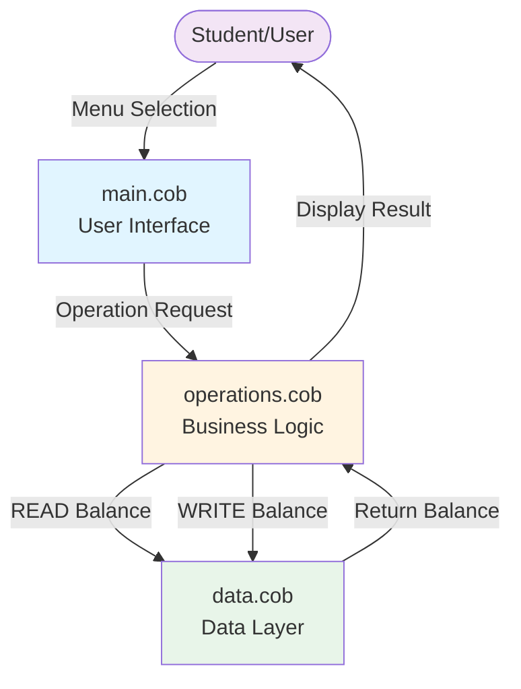
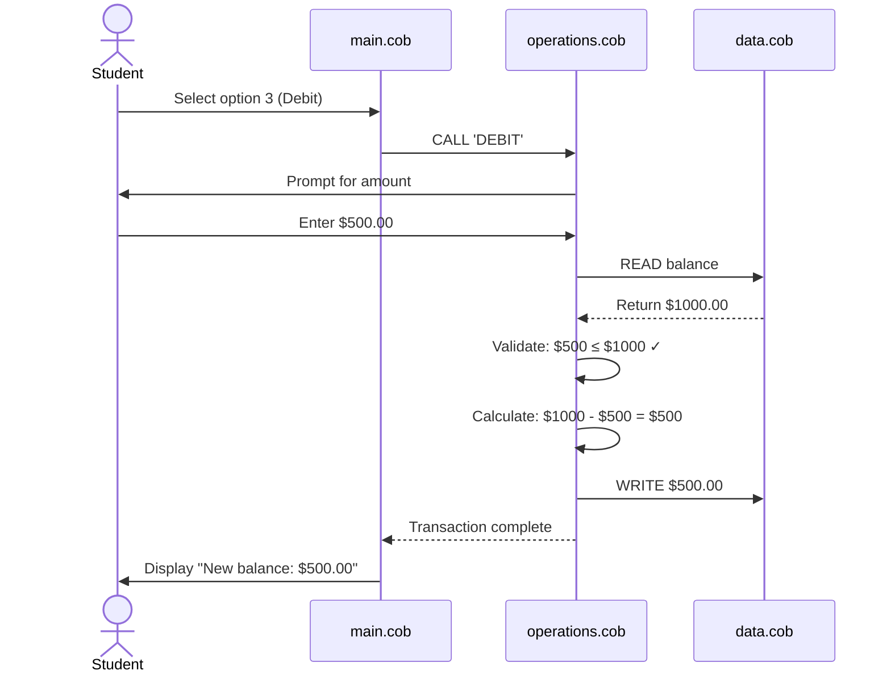
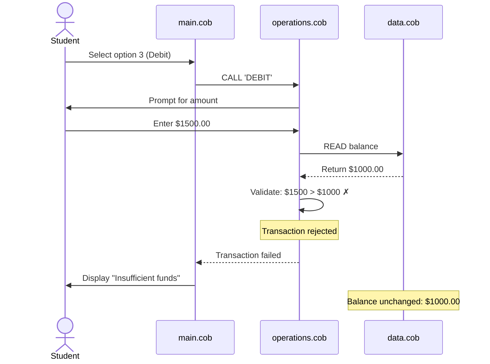

# COBOL Student Account Management System Documentation

## Overview

This is a legacy COBOL-based account management system designed for managing student account balances. The system provides basic banking operations including balance inquiries, credits (deposits), and debits (withdrawals).

## System Architecture

The system consists of three interconnected COBOL programs that work together to provide account management functionality:

---

## File Documentation

### 1. `main.cob` - Main Program Entry Point

**Program ID:** `MainProgram`

**Purpose:**

- Serves as the application entry point and user interface
- Displays the account management menu
- Captures user input and routes operations
- Controls the main program flow loop

**Key Functions:**

- **MAIN-LOGIC:** Primary procedure that runs continuously until the user exits
  - Displays a menu with 4 options
  - Accepts user choice (1-4)
  - Delegates operations to the `Operations` program
  - Manages the application lifecycle

**Working Storage Variables:**

- `USER-CHOICE` (PIC 9): Stores the user's menu selection (1-4)
- `CONTINUE-FLAG` (PIC X(3)): Controls program execution loop ('YES' or 'NO')

**Menu Options:**

1. View Balance - Displays current account balance
2. Credit Account - Add funds to the account
3. Debit Account - Withdraw funds from the account
4. Exit - Terminate the program

**Business Rules:**

- Input validation: Only accepts choices 1-4
- Invalid inputs display an error message and re-prompt
- Program continues until user explicitly selects option 4 (Exit)

---

### 2. `operations.cob` - Business Logic Layer

**Program ID:** `Operations`

**Purpose:**

- Implements core business operations for account management
- Acts as an intermediary between the UI (`main.cob`) and data layer (`data.cob`)
- Enforces business rules for financial transactions
- Handles user input for transaction amounts

**Key Functions:**

#### **TOTAL Operation** (View Balance)

- Retrieves current balance from the data layer
- Displays balance to the user
- No modifications to account state

#### **CREDIT Operation** (Deposit Funds)

- Prompts user for credit amount
- Retrieves current balance
- Adds credit amount to balance
- Persists updated balance
- Displays new balance confirmation

#### **DEBIT Operation** (Withdraw Funds)

- Prompts user for debit amount
- Retrieves current balance
- **Validates sufficient funds** before processing
- If funds sufficient: subtracts amount and updates balance
- If insufficient: displays error message and cancels transaction
- Displays transaction result

**Working Storage Variables:**

- `OPERATION-TYPE` (PIC X(6)): Stores the operation being performed
- `AMOUNT` (PIC 9(6)V99): Transaction amount (up to 999,999.99)
- `FINAL-BALANCE` (PIC 9(6)V99): Calculated account balance after operation

**Linkage Section:**

- `PASSED-OPERATION` (PIC X(6)): Receives operation type from caller

**Business Rules:**

- **Overdraft Protection:** Debit transactions are rejected if the withdrawal amount exceeds the current balance
- **Balance Limits:** Maximum balance/transaction amount is 999,999.99
- **Decimal Precision:** All amounts use 2 decimal places for currency accuracy
- **Transaction Atomicity:** Balance reads and writes are paired to ensure consistency

---

### 3. `data.cob` - Data Persistence Layer

**Program ID:** `DataProgram`

**Purpose:**

- Manages persistent storage of account balance
- Provides abstraction layer for data access
- Supports read and write operations
- Maintains single source of truth for balance data

**Key Functions:**

#### **READ Operation**

- Returns the current stored balance
- Does not modify any data
- Used by operations before any transaction

#### **WRITE Operation**

- Updates the stored balance with new value
- Overwrites previous balance
- Called after successful transactions

**Working Storage Variables:**

- `STORAGE-BALANCE` (PIC 9(6)V99): Persistent storage for account balance (default: 1000.00)
- `OPERATION-TYPE` (PIC X(6)): Internal copy of the requested operation

**Linkage Section:**

- `PASSED-OPERATION` (PIC X(6)): Operation type ('READ' or 'WRITE')
- `BALANCE` (PIC 9(6)V99): Balance value to read or write

**Business Rules:**

- **Initial Balance:** New accounts start with 1,000.00
- **Data Isolation:** All balance access must go through this program
- **Operation Types:** Only 'READ' and 'WRITE' operations are supported
- **Balance Format:** Stored with 2 decimal places (9(6)V99 format)

---

## Business Rules Summary

### Student Account Management Rules

1. **Account Initialization**

   - Default starting balance: $1,000.00
   - Balance range: $0.00 to $999,999.99

2. **Credit Transactions (Deposits)**

   - No maximum deposit limit (within balance capacity)
   - No minimum deposit amount
   - Balance immediately updated upon credit

3. **Debit Transactions (Withdrawals)**

   - **Critical Rule:** Insufficient funds prevent withdrawal
   - Cannot overdraw account (balance cannot go negative)
   - Withdrawal rejected if amount > current balance
   - Balance only updated if transaction succeeds

4. **Balance Inquiries**

   - Read-only operation
   - Does not modify account state
   - Shows real-time balance

5. **Data Integrity**

   - All monetary values use 2 decimal precision
   - Balance persistence maintained across operations
   - Atomic read-modify-write pattern for transactions

---

## Data Flow Examples

### Successful Debit Transaction

### Insufficient Funds Transaction

---

## Technical Specifications

### Program Communication

- **Inter-program calls:** Uses COBOL `CALL` statement
- **Parameter passing:** USING clause with LINKAGE SECTION
- **Return mechanism:** GOBACK statement

### Data Types

- **Currency amounts:** PIC 9(6)V99 (6 digits, 2 decimal places)
- **Operation codes:** PIC X(6) (6-character strings)
- **User choices:** PIC 9 (single digit)

### Error Handling

- Input validation for menu choices
- Insufficient funds checking for debits
- User-friendly error messages

---

## Future Modernization Considerations

When modernizing this legacy system, consider:

1. **Database Integration:** Replace in-memory storage with persistent database
2. **Multi-user Support:** Add user authentication and multiple account management
3. **Transaction History:** Implement audit trail and transaction logging
4. **Enhanced Validation:** Add input sanitization and format validation
5. **Error Logging:** Implement comprehensive error logging and monitoring
6. **API Layer:** Create RESTful API for modern client applications
7. **Security:** Add encryption for sensitive data and secure transaction processing
8. **Concurrency Control:** Implement locking mechanisms for concurrent access

---

## Maintenance Notes

- System uses legacy COBOL syntax and may require COBOL compiler for modifications
- All monetary calculations assume USD or similar 2-decimal currency
- Programs are tightly coupled; changes in one may affect others
- No external file I/O currently implemented (in-memory storage only)

---

**Last Updated:** December 5, 2025  
**Document Version:** 1.0
